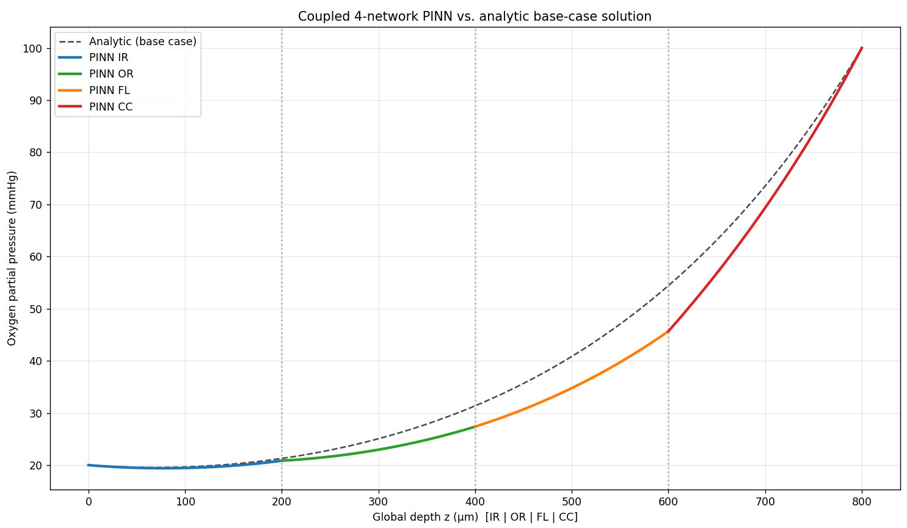

# Retinal O2 Transport PINN

A physics-informed neural network (PINN) solving the steady-state oxygen transport model through four retinal layers, based on:

> W. E. Schiesser, *Partial Differential Equation Analysis in Biomedical Engineering: Case Studies with MATLAB*, Cambridge University Press, 2013, Chapter 4, Listing 4.1 (base case, `ncase=2`).

```text
IR -> OR -> FL -> CC
```

Each layer has its own neural network, taking the layer's local depth `z ∈ [0, 200] μm` and predicting oxygen partial pressure `u(z)` in mmHg. The four networks are trained together, since each interface condition depends on predictions from two neighboring layers.

## Physical model

Inside each layer:

```text
D_i * u_i''(z) - k_i * u_i(z) = 0
```

**Confirmed base-case parameters** (same in all four layers):

| Quantity | Value |
| --- | --- |
| Diffusivity `D_i` | 1.0×10⁴ μm²/s |
| Metabolism rate `k_i` | 0.1 1/s |
| Layer length | 200 μm |
| Left boundary `u_IR(0)` | 20 mmHg |
| Right boundary `u_CC(200)` | 100 mmHg |
| Interface equilibrium constants `κ` | 1.0 |

Outer boundaries are Dirichlet conditions. At each interface, two conditions are enforced:

```text
u_left(200) = κ * u_right(0)                   # pressure equilibrium
u_right'(0) = (D_left / D_right) * u_left'(200) # flux continuity
```

## Project structure

| File | Purpose |
| --- | --- |
| `config.py` | Physical parameters, architecture, training settings, and loss weights |
| `networks.py` | Builds, saves, and loads one Keras MLP per layer |
| `physics.py` | PDE residuals, boundary residuals, interface residuals, and collocation sampling |
| `train_model.py` | Trains all four networks jointly with Adam and L-BFGS |
| `evaluate_model.py` | Loads a checkpoint, reports residuals, compares with the analytic solution, and plots the profile |
| `analytic.py` | Closed-form solution for the homogeneous base case, used as validation ground truth |
| `reference_data.py` | Separate dataset for an optional experiment; not ground truth for the base case because its boundary values are 26→130, not 20→100 |
| `checkpoints/` | Saved network weights created by `train_model.py` |

Each layer network is a 4-layer, 64-unit `tanh` MLP. Collocation points are sampled uniformly across each layer plus extra points concentrated near both ends, so the PDE residual has more resolution right at the interfaces.

## Running the model

```bash
python train_model.py        # trains all 4 networks, saves checkpoints/
python evaluate_model.py     # loads checkpoint, reports results, and saves a plot
```

Optional experiment using the separate reference dataset:

```bash
python evaluate_model.py --with-reference-data
```

## Current results

### Physics residuals

These residuals should be close to zero. PDE and outer-boundary values are mean-squared residuals. Interface values are raw residuals at the interface point.

| PDE residual | Mean squared value |
| --- | ---: |
| IR | 0.000043 |
| OR | 0.000033 |
| FL | 0.001091 |
| CC | 0.000334 |

| Outer boundary | Mean squared value |
| --- | ---: |
| left | 0.000000 |
| right | 0.000012 |

| Interface | Pressure residual | Flux residual |
| --- | ---: | ---: |
| IR-OR | 0.000130 | -0.013719 |
| OR-FL | 0.000101 | 0.002043 |
| FL-CC | 0.000031 | 0.079921 |

The pressure residuals are small at all interfaces. IR-OR and OR-FL also have small flux residuals, while FL-CC remains the largest interface mismatch and the main physics residual to improve.

### Comparison with the analytic solution

The PINN was compared with the closed-form analytic base-case solution, which is valid for this homogeneous base case only (equal D, equal k, κ=1 everywhere). `RelL2` is relative L2 error and `MAPE` is mean absolute percentage error.

| Layer | MAE | RMSE | RelL2 | MAPE |
| --- | ---: | ---: | ---: | ---: |
| IR | 0.2092 | 0.2438 | 0.0122 | 1.04% |
| OR | 2.1418 | 2.3747 | 0.0926 | 8.05% |
| FL | 6.1705 | 6.3218 | 0.1503 | 14.71% |
| CC | 4.2396 | 4.9330 | 0.0650 | 6.46% |

### Result profile

The plot below shows the four PINN layer profiles against the closed-form analytic base-case solution.



IR and CC are most accurate because they have a directly imposed outer boundary condition. OR and FL rely entirely on interface conditions shared with their neighbors, so small mismatches there propagate into larger errors in the interior. The FL-CC interface flux residual is currently the largest physics residual in the model and the main target for further improvement.

## Known limitations

- **FL and CC are the least accurate layers**, mainly because the true solution curves most steeply in that part of the domain. More network capacity or collocation points there would likely help.
- **The analytic solution is only valid for this exact base case**. If those parameters change, a different validation approach is needed.
- **`reference_data.py` contains a different scenario**, not this base case. It is kept only for the optional data-assisted experiment and is never used as ground truth here.
- **Only the steady-state, base-case, four-layer system is implemented.** The book's transient model, alternate diffusivity scenarios, and VEGF/photoreceptor extension are not covered here.

## Future work

1. Give FL and CC more network capacity as an isolated experiment.
2. Try a higher loss weight specifically for the FL-CC interface flux term as a separate isolated experiment. Do not combine it with step 1 in the same run, so the effect of each change remains measurable.
3. Re-run `evaluate_model.py` after each change and compare against the numbers in this README before keeping it.
